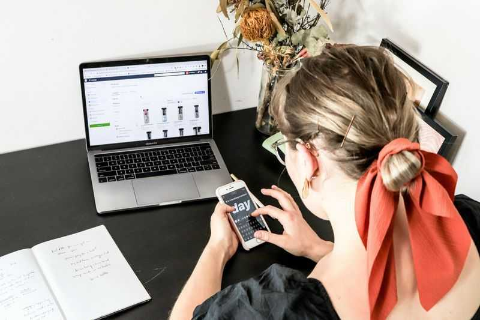

Ter uma conta profissional no Instagram deixou de ser diferencial e virou necessidade para qualquer negócio. Com ela, você acessa dados sobre seu público, adiciona botões de contato e usa ferramentas que a conta pessoal não oferece. A diferença no resultado é visível desde os primeiros dias.

A boa notícia é que criar uma conta profissional no Instagram é simples e gratuito. Você pode fazer isso a partir de uma conta pessoal existente ou começar do zero. Em nenhum dos casos é preciso conhecimento técnico.

Neste guia você vai ver cada etapa do processo, do começo ao fim. Também vai entender qual tipo de conta escolher e o que configurar logo depois da criação.

### O que é uma conta profissional no Instagram

O Instagram oferece dois modos de uso: pessoal e profissional. A conta pessoal é voltada para quem usa a plataforma para se conectar com amigos e família. A conta profissional é para quem quer usar o Instagram como canal de negócio.

Dentro do modo profissional, existem dois tipos: **Criador** e **Negócio**. Cada um tem recursos específicos, mas ambos dão acesso às ferramentas que a conta pessoal não tem. A escolha entre os dois depende do seu perfil, e vamos tratar disso mais adiante.

### Por que criar uma conta profissional no Instagram

Migrar para o modo profissional libera recursos que fazem diferença no dia a dia. Veja os principais:

- **Acesso a métricas:** você vê quantas pessoas viram seu post, de onde vieram e como interagiram.
- **Botões de contato:** o visitante pode ligar, mandar e-mail ou ver o endereço direto pelo perfil.
- **Informações de categoria:** você exibe o segmento do negócio logo abaixo do nome.
- **Agendamento de posts:** é possível programar publicações direto pelo app ou via ferramentas integradas.
- **Acesso a anúncios:** só contas profissionais podem impulsionar posts e criar campanhas no Instagram.
- **Integração com o Facebook:** conectar as duas plataformas facilita a gestão e amplia o alcance.

### Como criar uma conta profissional no Instagram: o passo a passo

Se você já tem uma conta pessoal, a migração é feita em menos de dois minutos. Se não tem, crie uma conta normal primeiro e depois siga os passos abaixo.

1. Abra o Instagram e acesse o seu perfil.
2. Toque no ícone de menu (três linhas) no canto superior direito.
3. Acesse **Configurações e privacidade**.
4. Role até encontrar **Tipo de conta e ferramentas** e toque nessa opção.
5. Toque em **Mudar para conta profissional**.
6. Escolha uma categoria que representa seu negócio e confirme.
7. Selecione o tipo de conta: **Criador** ou **Negócio**.
8. Siga as instruções para conectar ao Facebook (recomendado, mas opcional nessa etapa).
9. Conclua a configuração e volte ao perfil.

Pronto. Sua conta profissional no Instagram já está ativa.

### Conta Criador ou Conta Negócio: qual escolher?

A diferença entre os dois tipos é menor do que parece, mas vale entender antes de decidir.

A conta **Negócio** é indicada para empresas, lojas, prestadores de serviço e qualquer negócio com CNPJ ou operação comercial clara. Ela oferece integração completa com o Facebook, acesso ao Gerenciador de Anúncios e compatibilidade com ferramentas de agendamento de terceiros.

A conta **Criador** foi pensada para influenciadores, produtores de conteúdo e profissionais que constroem audiência em torno da própria pessoa. Ela tem recursos específicos para monetização e controle de mensagens por categoria.

Para a maioria dos pequenos negócios, a escolha certa é:

- **Conta Negócio:** lojas, clínicas, escritórios, restaurantes, prestadores de serviço, e-commerces.
- **Conta Criador:** coaches, influenciadores, criadores de conteúdo, palestrantes, artistas.

Se tiver dúvida, escolha **Negócio**. É possível trocar depois sem perder dados.

### O que configurar logo depois de criar a conta profissional

Criar a conta é só o primeiro passo. Para o perfil funcionar como vitrine do negócio, configure o seguinte:

- **Foto de perfil:** use o logo ou uma foto profissional com boa iluminação.
- **Nome de usuário:** mantenha simples, sem caracteres especiais e fácil de lembrar.
- **Bio:** explique em até 150 caracteres o que você faz e para quem.
- **Link na bio:** coloque o site, WhatsApp ou página de agendamento.
- **Categoria:** revise se a categoria exibida representa bem o seu negócio.
- **Botões de contato:** ative e-mail, telefone ou endereço conforme o seu tipo de atendimento.

### Como criar conteúdo para a sua nova conta profissional no Instagram

Ter uma conta profissional no Instagram bem configurada é o começo. O que sustenta o crescimento é a constância na publicação de conteúdo relevante.

Muitos negócios travam nessa etapa por falta de tempo, ideias ou por não saber o que funciona para o seu nicho. Criar posts com qualidade todos os dias exige mais do que boa vontade.

Ferramentas de criação de conteúdo com IA surgem como solução para esse problema. Elas reduzem o tempo de produção e ajudam a manter o perfil ativo sem depender de uma equipe de marketing.

---

Criar uma conta profissional no Instagram é o primeiro passo para transformar o perfil em um canal real de vendas. Com as configurações certas, seu negócio fica visível para quem já está procurando o que você oferece. O que vem depois é manter o perfil ativo com conteúdo que engaja e converte.

_[**Agora que sua conta profissional no Instagram está pronta, o próximo passo é criar conteúdo com consistência. Teste o PostCreator gratuitamente e veja como a IA cria posts completos para o seu negócio em poucos cliques.**](https://ravia.app/[cta_utm])_
