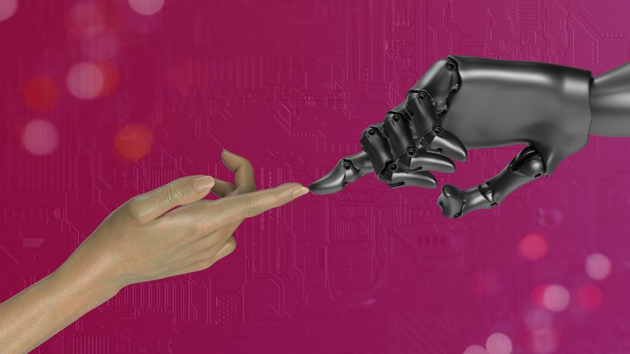
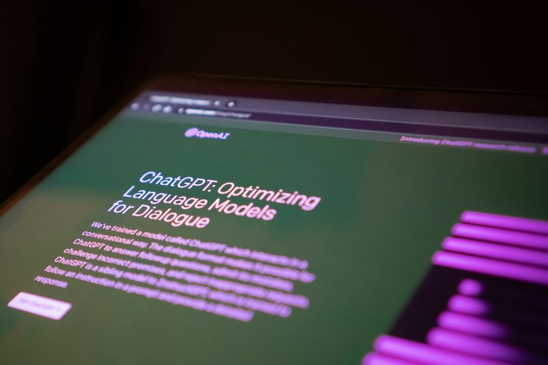

O termo inteligência artificial aparece em todo lugar, mas pouca gente sabe o que ele significa de verdade. Não é robô, não é ficção científica e não é algo restrito a grandes empresas de tecnologia. Entender o que é inteligência artificial hoje é tão útil quanto entender o que é a internet nos anos 2000.

A IA já está presente em ferramentas que você provavelmente usa todos os dias. Ela recomenda o próximo vídeo que você assiste, filtra spam do seu e-mail e sugere rotas no GPS. Tudo isso acontece sem você perceber, porque a tecnologia foi pensada para ser invisível.

Neste guia, você vai entender o conceito de forma simples e direta. Também vai ver exemplos práticos e descobrir como negócios comuns já estão usando IA para economizar tempo e crescer.

---

## O que é inteligência artificial, afinal?

Inteligência artificial é a capacidade de uma máquina realizar tarefas que normalmente exigiriam raciocínio humano. Isso inclui reconhecer imagens, entender texto, tomar decisões e gerar conteúdo. Não é magia: é matemática aplicada a grandes volumes de dados.

O termo foi criado na década de 1950, mas só ganhou força nos últimos anos. Isso aconteceu porque computadores ficaram mais rápidos e a quantidade de dados disponíveis cresceu muito. Hoje, a IA é acessível e está em ferramentas simples do dia a dia.

---

## Como a IA aprende a fazer as coisas

A IA aprende por repetição, assim como um ser humano aprende com a experiência. Você mostra milhares de exemplos para o sistema e ele identifica padrões. Com o tempo, ele passa a reconhecer situações novas com base no que aprendeu.

Esse processo se chama aprendizado de máquina. Não existe programador que escreve uma regra para cada situação. O próprio sistema descobre as regras a partir dos dados.

---

## Exemplos de inteligência artificial no seu dia a dia

Você já usa IA com frequência, mesmo sem saber. Veja alguns exemplos:

- **Spotify e Netflix:** recomendam conteúdo com base no seu histórico.
- **Gmail:** separa spam da caixa de entrada automaticamente.
- **Google Maps:** sugere rotas em tempo real considerando o trânsito.
- **Corretor do celular:** aprende o seu jeito de escrever e sugere palavras.
- **Atendimento via chat:** muitos bots de suporte usam IA para responder perguntas.

Todos esses sistemas foram treinados com dados reais para tomar decisões úteis.

---

## O que a IA não é (desfazendo mitos)

Muita gente associa inteligência artificial a robôs humanoides ou a sistemas que pensam como humanos. Isso não é o que a tecnologia faz na prática. A IA executa tarefas específicas muito bem, mas não tem consciência, emoções ou vontade própria.

Outros mitos comuns:

- **"IA vai substituir todos os empregos":** ela automatiza tarefas repetitivas, não funções humanas complexas.
- **"Só grandes empresas usam IA":** hoje qualquer pessoa acessa ferramentas de IA gratuitamente.
- **"IA é sempre precisa":** ela comete erros, especialmente com dados fora do padrão que aprendeu.

---

## Como pequenos negócios já usam inteligência artificial

Um personal trainer pode usar IA para criar posts sobre treino e nutrição em minutos. Um advogado pode gerar conteúdo explicando direitos do consumidor sem passar horas escrevendo. Uma loja pode manter o Instagram ativo todos os dias sem contratar um social media.

Essas aplicações já existem e estão disponíveis agora. O que muda é o tempo gasto em tarefas que antes exigiam horas de trabalho. A IA não substitui o dono do negócio: ela libera tempo para ele focar no que só ele pode fazer.

---

## O que muda quando você começa a usar IA no seu negócio

A principal mudança é de ritmo. Tarefas que levavam horas passam a levar minutos. Você consegue manter uma presença digital consistente sem abrir mão do tempo com clientes ou com a operação.

Com o tempo, essa consistência gera resultado visível. Um perfil ativo no Instagram atrai mais clientes, constrói autoridade e gera indicações. A IA não faz o negócio crescer sozinha, mas remove as barreiras que travavam esse crescimento.

---

Entender o que é inteligência artificial não exige formação técnica nem experiência com tecnologia. Exige apenas ver a IA pelo que ela é: uma ferramenta que aprende com dados e executa tarefas repetitivas no lugar das pessoas. Para quem tem um negócio, isso significa menos tempo perdido e mais espaço para crescer.

_[**Quer ver a inteligência artificial funcionando na prática? Crie seu primeiro post para o Instagram agora com o PostCreator, de graça e sem cartão de crédito.**](https://ravia.app/[cta_utm])_
